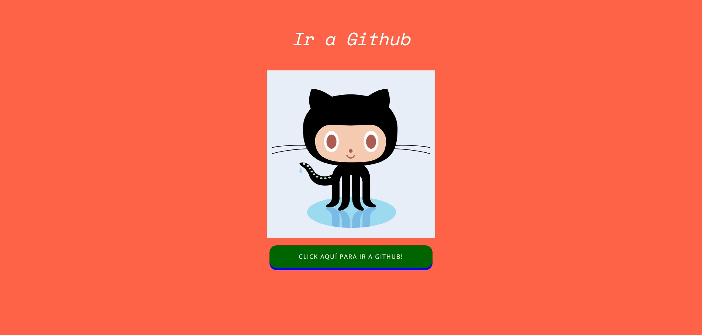

# Desafío evaluado - Branching

En este desafío se aplico las etapas del versionamiento de git, para mantener un repositorio de versiones.

- Cree los directorios, movi el style a su lugar y elimina los styles que sobraban.
- arregle el link de la imagen, puse un target blank y agregue el style.css
- cambie el color de fondo
- se creo el archivo script.js y se agrego al index.html