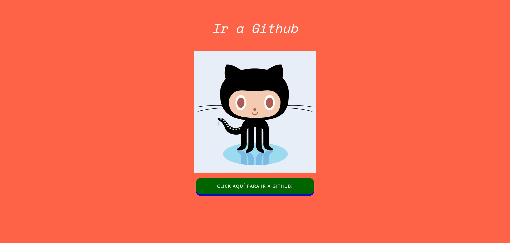

# Desafío evaluado - Branching

Este proyecto es una página web simple que incluye un enlace a GitHub, un botón para ir a GitHub y la imagen de Octocat. Está diseñado para practicar el uso de branching en Git.

## Descripción

La página web muestra un título, una imagen de Octocat y un botón que enlaza a GitHub.

## Vista Codificada

A continuación, se muestra la imagen del resultado codificado:

## Estructura del Proyecto

El proyecto se compone de las siguientes secciones:

- **Encabezado (`<head>`)**: Contiene los metadatos del documento, como el conjunto de caracteres, la vista adaptable y el autor.
- **Cuerpo (`<body>`)**: Contiene la estructura principal de la página con un título, una imagen y un botón.

## Tecnologías Utilizadas

- HTML5
- CSS3
- JavaScript

## Autor

Este proyecto fue desarrollado por **Valeria Torrealba**.